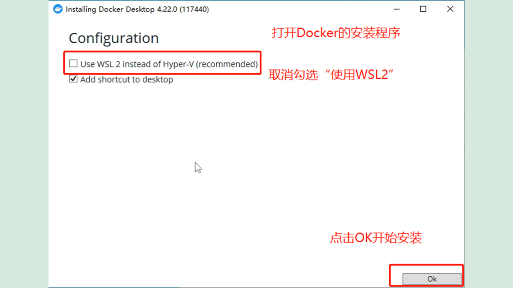
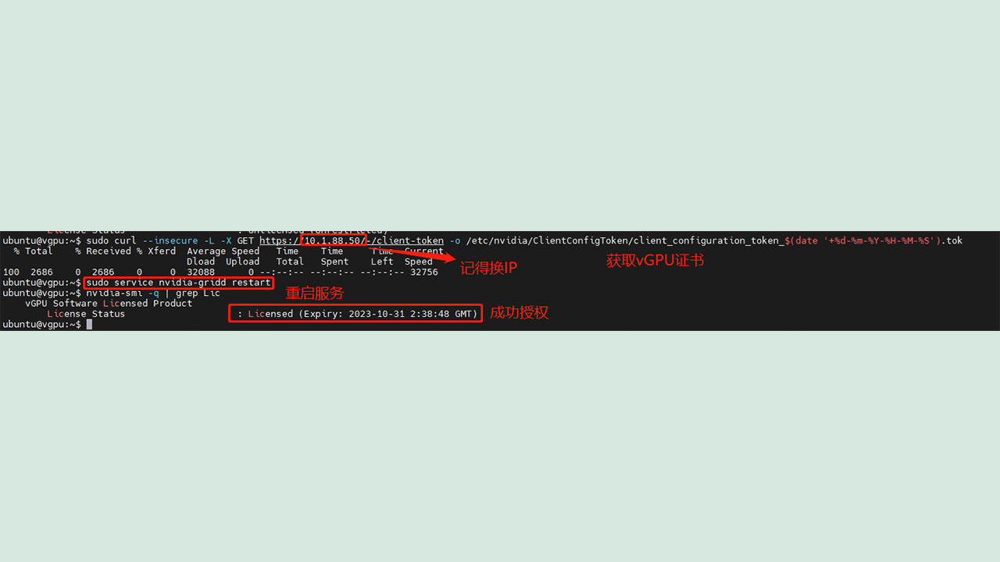

# vGPU使用指南

编写时间 2023-8-2 
修改时间 2025-3-18

> PvE 8.1安装vGPU教程推荐：[链接 https://blog.mitsea.com/d29bb28b14984443b232263348b946ba](https://blog.mitsea.com/d29bb28b14984443b232263348b946ba)

## 预览

1. vGPU介绍
2. 下载vGPU软件包
3. 在ESXI8上安装vGPU软件包
4. 用Docker部署**免费的**授权服务
5. 在客户机上使用vGPU

## vGPU介绍

NVIDIA vGPU是一个显卡虚拟化程序，你可以用它把一块16GB显存的特斯拉T4分成4个4GBvGPU。具体显存大小可以自行配置。把vGPU和VMware虚拟化结合，就可以新建虚拟机给其它用户用显卡做实验。vGPU是需要授权的付费产品，不过不用担心，本文提供了免费使用的方法。这篇文章是在ESXI8上安装vGPU软件。

## 下载vGPU软件包

由于原计划的仓库**已经失效**，现在vGPU的软件包可以从这个仓库的Issues中找分享的链接。

下载完文件后，把它解压出来，里面有三个文件夹，分别是`Guest_Drivers`，`Host_Drivers`，`Signing_Keys`和一些PDF说明。我们只需要用到`Guest_Drivers`和`Host_Drivers`。`Guest_Drivers`是给虚拟机用的vGPU驱动，`Host_Drivers`是安装到ESXI主机上的软件。

## 在ESXI8上安装vGPU软件包

先把ESXI连接到vCenter，之后要用。

首先打开ESXI的网页，先把ESXI主机进入维护模式，然后打开SSH。

使用SSH工具连接到ESXI主机。

新建一个SFTP窗口，通过SFTP把两个zip文件上传到ESXI主机上的`/tmp`目录下。如果您上传到ESXI主机的根目录可能会报错。

使用`esxcli`安装vGPU驱动程序

        # 请不要盲目复制，根据自己的文件目录做修改!
        # 路径必须是绝对路径!
        
        # 先安装NVD-VGPU开头的软件包
        esxcli software vib install -d /tmp/NVD-VGPU-800_525.85.07-1OEM.800.1.0.20613240_21166548.zip
        esxcli software vib install -d /tmp/nvd-gpu-mgmt-daemon_525.85.07-0.0.0000_21145710.zip

安装成功后用`nvidia-smi`检查有没有识别到显卡

        # 检测显卡
        nvidia-smi

为了保证vGPU的运行，您需要关闭显卡的ECC纠错

        # 关闭ECC纠错
        nvidia-smi -e 0

以上是命令行上的操作，接下来切换到网页端，点击重新引导主机，等待主机完成重启后关闭维护模式。

登录到vCenter，选择刚才安装vGPU驱动的ESXI主机。点击菜单栏中的`配置`，在刷新的窗口中点击`图形`。点击`主机图形`，点击`编辑`打开`编辑主机图形设置`窗口。在设置窗口里选择`直接共享`，点击`确定`完成设置。

之后点击`图形设备`，选择任意一张显卡，点击`编辑`打开设置窗口。在设置窗口里不需要修改任何设置，只需要确保`重启X服务器`勾选就可以，然后点击`确定`重启X服务器。

完成上面的步骤后，在ESXI上安装vGPU就完成了。

## 用Docker部署免费的授权服务

我在虚拟拟机上新建了一个Windows Server虚拟机，用来安装dorker。请注意，在新建虚拟机时要在CPU页面勾选`硬件辅助的虚拟化`。有经验的读者可以使用Liunx。

系统安装过程略。

请关闭Windwos防火墙，并打开远程桌面。

然后用RDP连接上虚拟机

首先在服务器管理中启用Hyper-V，我用Hyper-V来运行Docker。有经验的读者可以使用WSL2。

前往docker上下载Docker Desktop

        # Docker 官网
        https://www.docker.com/

安装时记得取消`用WSL2代替Hyper-V`

安装完成后重启主机

在开机后先打开`Docker Desktop`启动Docker引擎

启动完成，打开`CMD`，输入这些Docker命令。

        # 先拉取镜像
        docker pull makedie/fastapi-dls
        # 然后创建容器
        # 请更改DLS_URL后面的值，修改成你的IP地址
        docker run -d -e DLS_URL=10.1.88.50 -e DLS_PORT=443 -p 443:443  makedie/fastapi-dls

启动后在浏览器输入`https://10.1.88.50`，检查容器是否成功启动。

看到readme界面就可以了

## 在客户机上使用vGPU

在这里我演示两种平台，Windwos和Linux。Windwos我用的版本是`Windwos Server 2022`，Linux使用的版本是`Ubuntu Server 22.04`。你可以挑其中一个看，两个部分的内容都很充分。

### Windows平台

创建虚拟机，在新建虚拟机的页面先不编辑配置。虚拟机创建完成后，编辑虚拟机配置。

添加一个PCI设备，可以看到有`grid_t4-8q`这样的vGPU配置文件。我简单讲一下:

<table>
 <tr>
  <td>配置文件名称</td><td>物理显卡</td><td>显存大小</td><td>vGPU模式</td>
 </tr>
  <tr>
  <td>grid_t4-8q</td><td>特斯拉T4</td><td>8GB</td><td>vDWS</td>
 </tr>
  <tr>
  <td>grid_t4-1b</td><td>特斯拉T4</td><td>1GB</td ><td>vPC</td>
 </tr>
  <tr>
  <td>grid_t4-4a</td><td>特斯拉T4</td><td>4GB</td><td>vAPP</td>
 </tr>
  <tr>
  <td>grid_t4-4c</td><td>特斯拉T4</td><td>4GB</td><td>vCS</td>
 </tr>
</table>

> 注意vDWS和vCS才支持CUDA

为了展示调整显存的功能，我选择`grid_t4-8q`，8GB的vDWS。

直通了PCI卡后，要锁定所有的内存才能开机。

最后再检查一下安全启动有没有勾选，勾选了就取消勾选。安装Windows怕错过`点击任意键继续`可以勾选`强制开机时进入EFI`界面。

之后就是安装系统，这个部分略。

系统安装完成后，关闭防火墙，打开远程桌面。

用RDP连上虚拟机。

来到之前vGPU软件包的`Guest_Drivers`文件夹下，把给windows用的`exe`驱动通过RDP窗口上传到服务器。

> 用RDP传文件的方法：在本地主机右键复制，然后在RDP窗口里右键粘贴。

双击`exe`文件，安装vGPU驱动。

安装完成，打开`CMD`，输入`nvidia-smi`查看显卡输出。可以看到显存有8GB。

        # 查看显卡输出
        nvidia-smi

然后再输入`nvidia-smi -q`，往上划一段。看到`1`字样，这是vGPU的授权情况。`1`字段的值是`1`代表还没授权。

        # 查看显卡信息
        nvidia-smi -q

然后用管理员模式打开`powershell`，是`powershell`不是`CMD`。输入这段命令给你的vGPU添加授权。

> 用管理员模式打开`powershell`而不是打开`CMD`

        # 下载证书到指定位置
        # 把我的IP地址改成你的
        curl.exe --insecure -L -X GET https://10.1.88.50/-/client-token -o "C:\Program Files\NVIDIA Corporation\vGPU Licensing\ClientConfigToken\client_configuration_token_$($(Get-Date).tostring('dd-MM-yy-hh-mm-ss')).tok"

        # 重启vGPU CLS服务
        Restart-Service NVDisplay.ContainerLocalSystem

        # 等一分钟
        # 查看vGPU授权情况
        & 'nvidia-smi' -q  | Select-String "License"

如果成功添加授权会有这样的输出

        # 成功授权的输出
        vGPU Software Licensed Product
        License Status                    : Licensed (Expiry: YYYY-M-DD hh:mm:ss GMT)

Windows平台的示范结束，下面是Linux平台的示范。

### Linux平台

创建虚拟机，在新建虚拟机的页面先不编辑配置。虚拟机创建完成后，编辑虚拟机配置。

添加一个PCI设备，可以看到有`grid_t4-8q`这样的vGPU配置文件。我简单讲一下:

<table>
 <tr>
  <td>配置文件名称</td><td>物理显卡</td><td>显存大小</td><td>vGPU模式</td>
 </tr>
  <tr>
  <td>grid_t4-8q</td><td>特斯拉T4</td><td>8GB</td><td>vDWS</td>
 </tr>
  <tr>
  <td>grid_t4-1b</td><td>特斯拉T4</td><td>1GB</td ><td>vPC</td>
 </tr>
  <tr>
  <td>grid_t4-4a</td><td>特斯拉T4</td><td>4GB</td><td>vAPP</td>
 </tr>
  <tr>
  <td>grid_t4-4c</td><td>特斯拉T4</td><td>4GB</td><td>vCS</td>
 </tr>
</table>

> 注意vDWS和vCS才支持CUDA

为了展示调整显存的功能，我选择`grid_t4-8q`，8GB的vDWS。

直通了PCI卡后，要锁定所有的内存才能开机。

最后再检查一下安全启动有没有勾选，勾选了就取消勾选。

然后启动虚拟机，正常安装系统。安装系统的过程略。

安装完成后，用SSH和SFTP连上Linux。

在`Guest_Drivers`中找到驱动`run`文件并通过SFTP上传到Linux虚拟机。

用下面的命令安装显卡需要的依赖库。

        # 更新软件包
        sudo apt update
        sudo apt upgrade -y

        # 下载依赖
        sudo apt install g++ gcc make -y

禁用默认nouveau显卡驱动

        # 打开禁用驱动配置文件
        sudo nano /etc/modprobe.d/blacklist.conf

        # 在文件的末尾加上这两段
        blacklist nouveau
        options nouveau modeset=0

        # 关闭nano编辑器
        # 然后更新内核
        sudo update-initramfs -u

        # 重启
        sudo reboot

        # 重启完电脑后用命令检查显卡驱动有没有在运行
        # 没有输出就是禁用成功
        lsmod | grep nouveau

禁用成功后安装显卡驱动

        # 添加运行权限
        # 请将NVIDIA.run替换成您的驱动程序的名字
        sudo chmod +x ./NVIDIA.run
        # 安装
        # 详细的安装步骤看截图
        ./NVIDIA.run

安装成功后查看输出

        # 查看输出
        nvidia-smi

        # 查看vGPU授权
        nvidia-smi -q | grep Lic

        # 给vGPU添加授权
        curl --insecure -X GET https://10.1.88.50/client-token -o /etc/nvidia/ClientConfigToken/client_configuration_token.tok
        
        # 重启vGPU CLS服务
        service nvidia-gridd restart
        
        # 等一分钟
        # 查看授权情况
        nvidia-smi -q | grep "License"

如果成功添加授权会有这样的输出

        # 成功授权的输出
        vGPU Software Licensed Product
        License Status                    : Licensed (Expiry: YYYY-M-DD hh:mm:ss GMT)

本文章到此结束，希望对你有所帮助。
